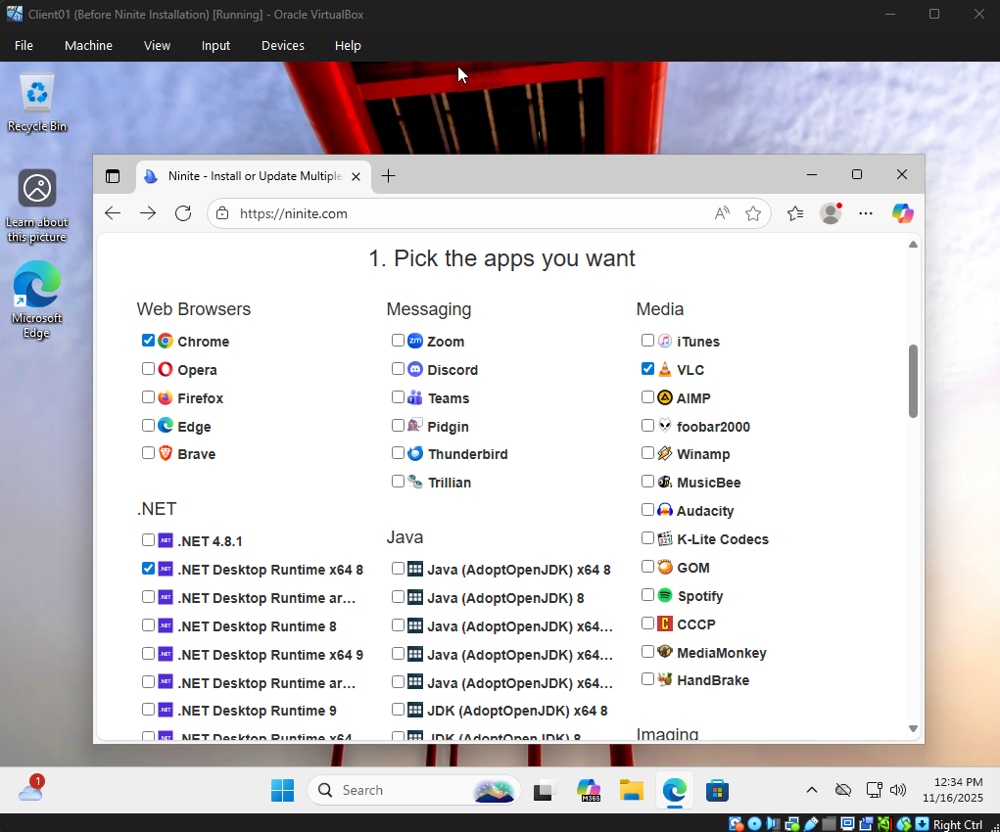
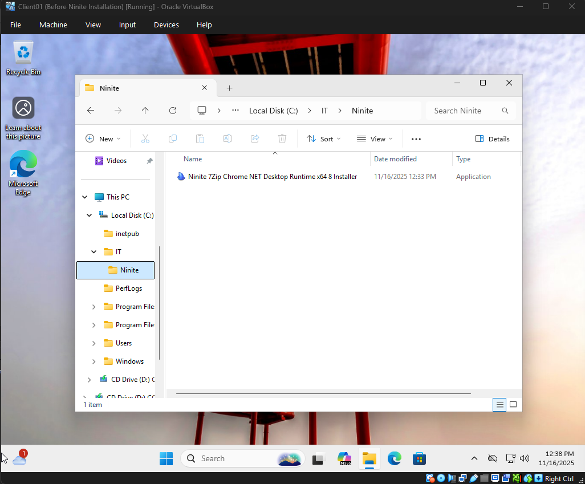
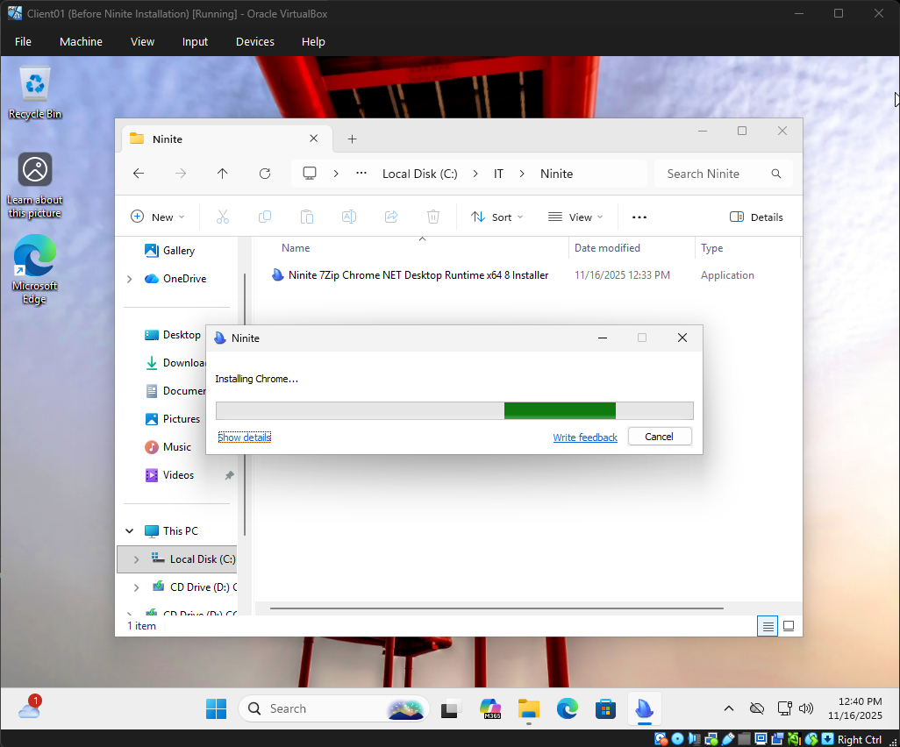
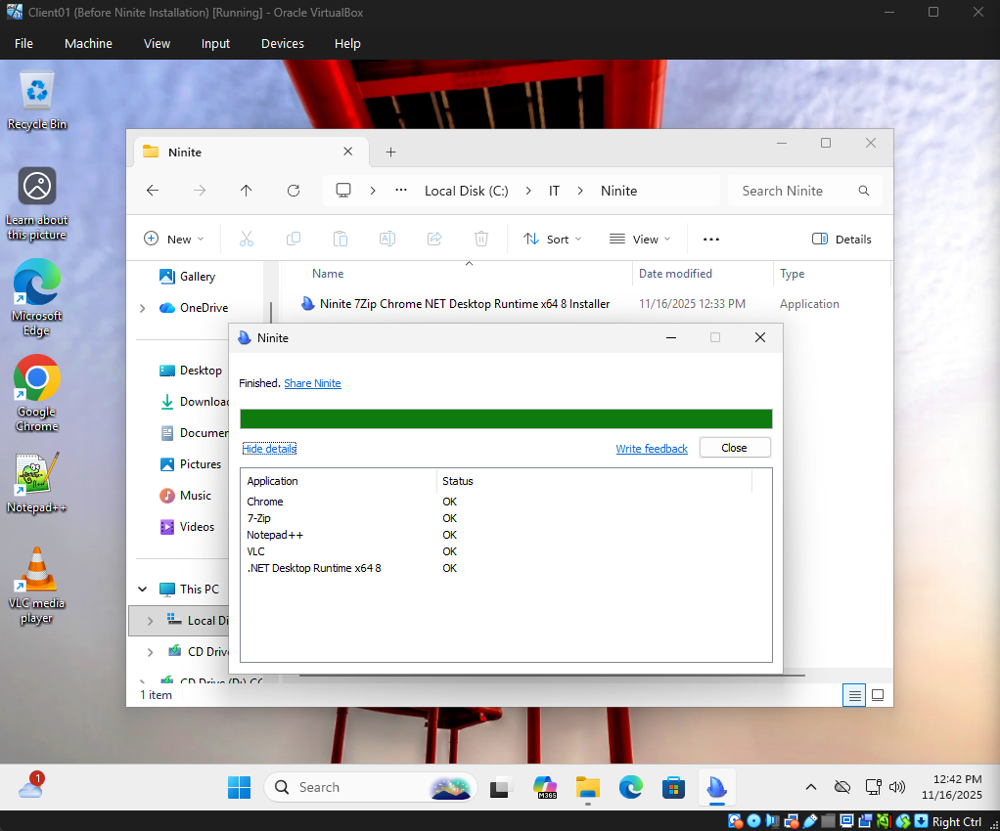
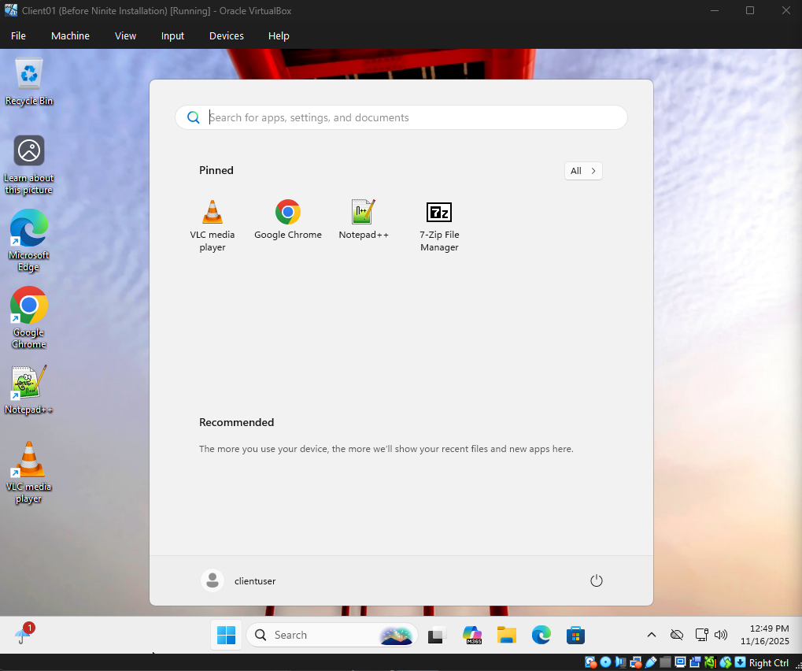
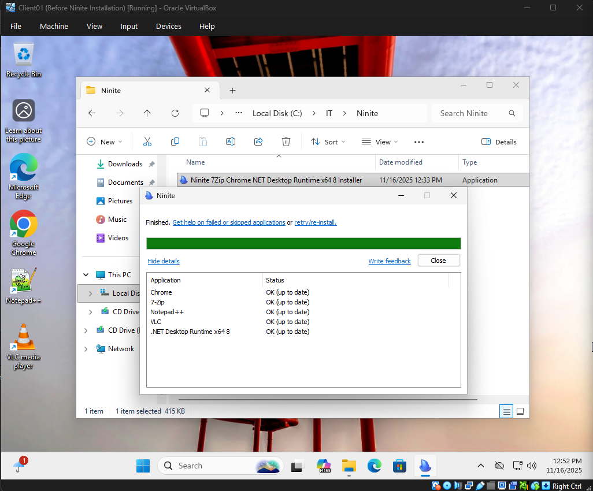
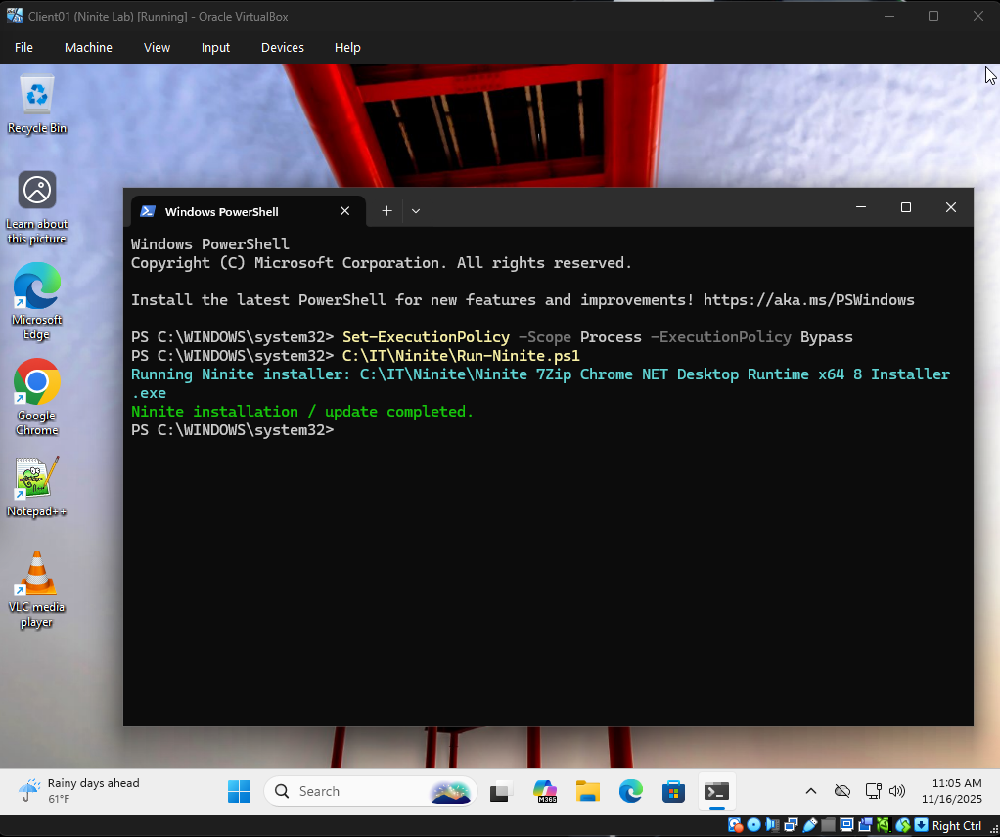

---

# Ninite Software Deployment Lab

Automated Software Installation and Updates Using Ninite and PowerShell

This lab demonstrates how to automate software deployment and update workflows across Windows clients using Ninite, PowerShell, and a domain-joined Windows 11 virtual machine inside VirtualBox.

This type of work is common in Help Desk, Desktop Support, and junior SysAdmin roles, especially in organizations managing multiple remote sites or standardized workstation builds.

---

## Lab Objectives

* Install a standard workstation software stack using Ninite
* Re-run Ninite to automatically update installed applications
* Automate silent installations with PowerShell
* Capture output from automated installs
* Document the workflow with screenshots for a professional portfolio

---

## Environment

| Component         | Details                        |
| ----------------- | ------------------------------ |
| Hypervisor        | Oracle VirtualBox              |
| Domain Controller | Server01 (Windows Server 2022) |
| Client            | Client01 (Windows 11 Pro)      |
| Working Directory | `C:\IT\Ninite\`                |
| Tools Used        | Ninite, PowerShell             |
| Snapshot          | Ninite Lab                     |

---

## Folder Structure

```
C:\
 └── IT\
      └── Ninite\
           ├── Ninite 7Zip Chrome NET Desktop Runtime x64 8 Installer.exe
           └── Run-Ninite.ps1
```

---

## Screenshots

### 1. Selecting the software bundle on Ninite.com

Shows selection of Chrome, VLC, 7-Zip, Notepad++, and .NET.



### 2. Installer downloaded into `C:\IT\Ninite`

Organized like a real-world IT support environment.



### 3. Running the Ninite installer

Shows a silent, unattended installation in progress.



### 4. Installation completed

Displays final status for each application.



### 5. Applications installed

Chrome, VLC, Notepad++, and 7-Zip appear in the Start Menu.



### 6. Ninite update check

Re-running the installer updates any out-of-date applications.



### 7. Automated PowerShell script running

PowerShell executes the silent installer and outputs completion.



---

## PowerShell Automation Script (`Run-Ninite.ps1`)

```powershell
# run the first ninite installer found in c:\it\ninite silently
$installer = get-childitem "C:\IT\Ninite" -filter "Ninite*.exe" | select-object -first 1

if ($null -eq $installer) {
    write-host "no ninite installer found in c:\it\ninite" -foregroundcolor red
    exit 1
}

# execute installer silently and wait until it finishes
write-host "Running Ninite installer: $($installer.FullName)" -foregroundcolor cyan
Start-Process $installer.FullName -ArgumentList "/silent" -Wait

write-host "Ninite installation / update completed." -foregroundcolor green
```

This script:

* Searches for the first available Ninite installer
* Executes it silently with no user prompts
* Waits for completion
* Provides clear status output
* Can be scheduled or pushed out to client machines

---

## Skills Demonstrated

* Software deployment and update automation
* Introductory PowerShell scripting
* Virtual machine and lab management
* IT folder organization and file structure
* Logging and documenting technical work
* Real-world Help Desk and SysAdmin workflow

---

## Why This Project Matters

Ninite is widely used in environments without enterprise-level software deployment tools, including MSPs, small businesses, hotels, retail chains, and distributed organizations.

This lab demonstrates practical, real-world skills including:

* Standard workstation build processes
* Silent software deployment
* Automated patching and updates
* Script-based repeatable workflows

These are exactly the types of tasks performed in early IT roles.

---

## Summary

This project shows a complete automated software deployment process using VirtualBox, a domain environment, Ninite, and PowerShell. It provides real-world value for Help Desk, Desktop Support, and Junior SysAdmin positions and demonstrates your ability to automate and document IT workflows.

---
